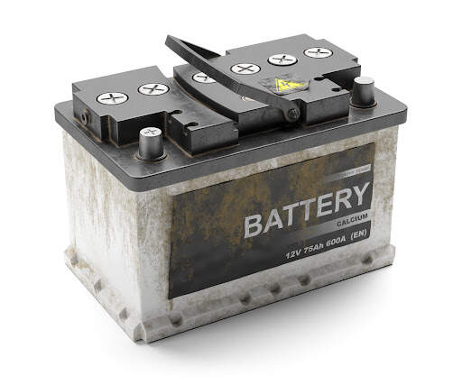

# AR Car Repair Guide

An Augmented Reality (AR) car repair guide designed to assist users with removing and handling car batteries. The app uses **PlugXR** for AR functionality, requiring users to download the PlugXR Viewer app and scan a target marker (battery image) to view the AR scene.

---

## Features
- **Interactive AR Guidance**: Provides step-by-step battery removal instructions through AR overlays.
- **Target Marker Recognition**: Detects a car battery image as the marker to trigger the AR scene.
- **User-Friendly Interface**: Simplifies car repair tasks with intuitive AR visualizations.

---

## Getting Started

### Prerequisites
1. **Download the PlugXR Viewer App**  
     - **QR Code**:  
       
   
   - **APK File**: [Download PlugXR Viewer APK](https://drive.google.com/file/d/1wnKjAxr_WiKEwi3bhQ0unhtZgH1Kzmuw/view?usp=drive_link)

2. **Obtain the Marker**
   Use the image below as the target marker for the AR scene:  

   - **Marker Image**:  
     
     
---

### Usage Instructions
1. **Launch the PlugXR Viewer App**.
2. **Scan the Marker**:  
   Point your device's camera at the target marker image above. The AR scene will load automatically.
3. **Follow the AR Instructions**:  
   View and interact with the AR overlays for battery removal instructions.

---

## Marker Details
- **Marker Image**: Stored in the `target_marker.jpg`.
- Ensure proper visibility and lighting for accurate marker detection.

---

## Future Enhancements
- Additional AR scenes for other car repair tasks.
- Voice-guided instructions to complement AR visuals.
- Integration with real-time expert assistance.

---

## Contact
For questions, suggestions, or feedback, please reach out to **Snehasis Medda**.
